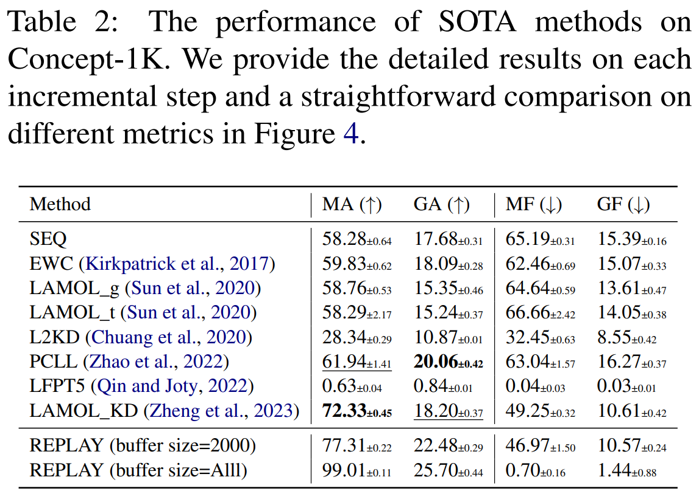
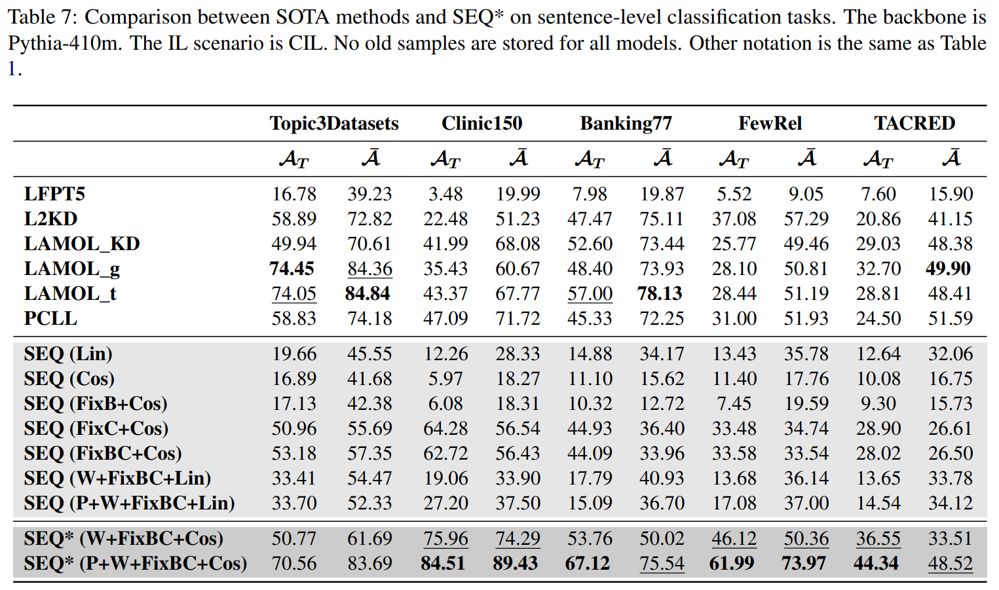
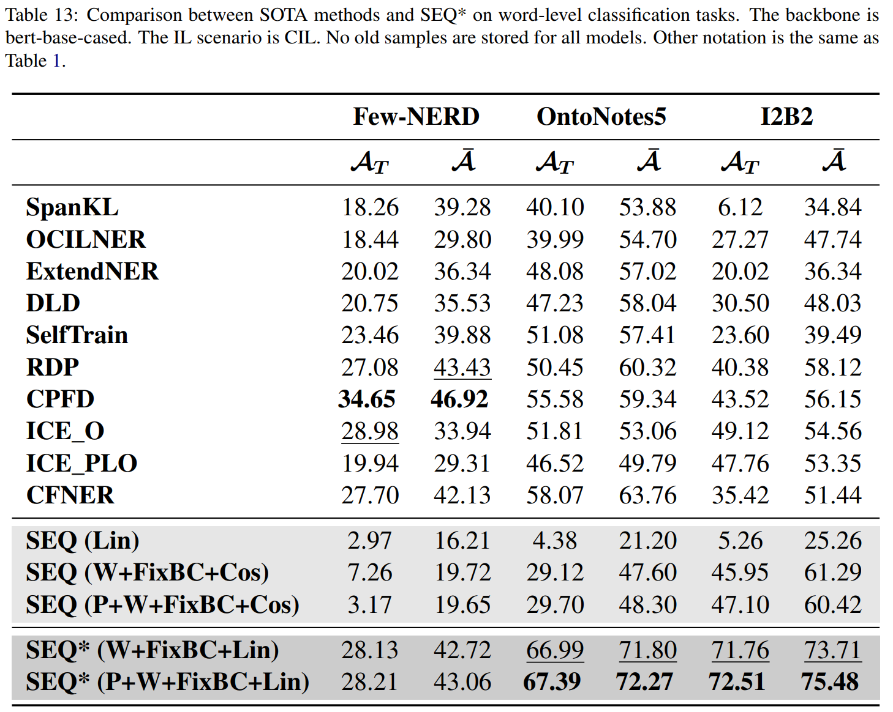

# [ACL 2024] A Codebase for Incremental Learning with Large Language Models

[](https://arxiv.org/abs/2312.07887)
[](https://arxiv.org/abs/2402.10447v1)
[](https://arxiv.org/abs/2402.08526)

## Contents
- [Introduction](#Introduction)
- [Supported List](#Supported%20List)
- [Usage](#Usage)

## Introduction
This is a repository for Incremental Learning with Large Language Models. 
- It supports both generative and discriminative models in [transformers](https://huggingface.co/docs/transformers/index).
- It supports using [accelerate](https://huggingface.co/docs/accelerate/index) for distributed data parrallel and model parallel.
- It supports using [wandb](https://wandb.ai/site) for logging.

<!-- Please refer to [this repository](https://github.com/zzz47zzz/pretrained-lm-for-incremental-learning-survey) for survey, resource, and paper in this area. -->

## Supported List

### Scenario
- [x] [Instance-Incremental Learning](https://arxiv.org/abs/2402.08526)
- [x] Class-Incremental Learning
- [x] Task-Incremental Learning

### Tasks
- [x] Text Classification
- [x] Intent Classification
- [x] Relational Extraction
- [x] Named Entity Recognition

### Methods

More baselines will be released in the future!

#### General (Text/Intent) Classification
- [x] SEQ
- [x] [ExperienceReplay](https://arxiv.org/abs/1902.10486)
- [x] [PEFT (including, LoRA, PromptTuning)](https://huggingface.co/docs/peft/index)
- [x] [LAMOL (ICLR 2020)](https://openreview.net/forum?id=Skgxcn4YDS)
- [x] [LAMOL_KD (arXiv)](https://arxiv.org/abs/2312.07887)
- [x] [L2KD (EMNLP 2020)](https://aclanthology.org/2020.emnlp-main.233/)
- [x] [AdapterCL (EMNLP 2021)](https://aclanthology.org/2021.emnlp-main.590/)
- [x] [PCLL (EMNLP 2022)](https://aclanthology.org/2022.emnlp-main.766/)
- [x] [LFPT5 (ICLR 2022)](https://openreview.net/forum?id=7mozamSFNt4)
- [x] [ProgPrompt (ICLR 2023)](https://openreview.net/forum?id=UJTgQBc91_)
- [x] [SEQ* (ACL 2024)](https://arxiv.org/abs/2312.07887)
<!-- - [ ] [ConTinTin (ACL 2022)](https://aclanthology.org/2022.acl-long.218/) -->
<!-- - [ ] [AdapComModules (ACL 2022, code is available but hard to implement)](https://aclanthology.org/2022.acl-long.255/) -->
<!-- - [ ] [LotteryPrompt (ACL 2023, code not available for now)](https://aclanthology.org/2023.acl-long.16/) -->


<!-- #### Relation Extraction
- [ ] [SCKD (ACL 2023 findings)](https://arxiv.org/pdf/2305.06616.pdf)
- [ ] [FEA (arxiv 2022)](https://arxiv.org/abs/2209.00243)
- [ ] [CRECL (COLING 2022)](https://aclanthology.org/2022.coling-1.163/)
- [ ] [KIP-Frame (TASLP 2022)](https://ieeexplore.ieee.org/abstract/document/9860068/)
- [ ] [ERDA (ACL 2022)](https://aclanthology.org/2022.acl-long.198/)
- [ ] [CRL (ACL 2022 findings)](https://aclanthology.org/2022.findings-acl.268/)
- [ ] [RPCRE (ACL 2021)](https://aclanthology.org/2021.acl-long.20/)
- [ ] [CML (AAAI 2021)](https://ojs.aaai.org/index.php/AAAI/article/view/17241)
- [ ] [IDLVQ-C (ICLR 2021)](https://openreview.net/forum?id=3SV-ZePhnZM)
- [ ] [EMAR (ACL 2020)](https://aclanthology.org/2020.acl-main.573/) -->

#### Named Entity Recognition
- [x] [ExtendNER (AAAI 2021)](https://ojs.aaai.org/index.php/AAAI/article/view/17600)
- [x] [SelfTrain (EMNLP 2022)](https://aclanthology.org/2022.emnlp-main.236/)
- [x] [CFNER (EMNLP 2022)](https://aclanthology.org/2022.emnlp-main.236/)
- [x] [SpanKL (AAAI 2023)](https://arxiv.org/pdf/2302.12200.pdf)
- [x] [DLD (SIGIR 2023)](https://dl.acm.org/doi/abs/10.1145/3539618.3591970)
- [x] [RDP (CIKM 2023)](https://arxiv.org/pdf/2308.08793.pdf)
- [x] [CPFD (EMNLP 2023)](https://openreview.net/attachment?id=VLrtaSXOWP&name=pdf)
- [x] [OCILNER (ACL 2023)](https://aclanthology.org/2023.acl-long.328/)
- [x] [ICE (ACL 2023 findings)](https://aclanthology.org/2023.findings-acl.141.pdf)
- [x] [IS3 (ACL 2024 findings)](https://arxiv.org/abs/2402.10447v1)

#### Original for Image Classification
- [x] [DER++ (NIPS2020)](https://proceedings.neurips.cc/paper/2020/hash/b704ea2c39778f07c617f6b7ce480e9e-Abstract.html)
- [x] [CLSER (ICLR2022)](https://openreview.net/forum?id=uxxFrDwrE7Y)
- [x] [EWC (PNAS 2017)](https://www.pnas.org/doi/abs/10.1073/pnas.1611835114)
<!-- - [ ] [A-GEM (ICLR 2019)](https://arxiv.org/abs/1812.00420)
- [ ] [GEM (NIPS 2017)](https://proceedings.neurips.cc/paper/2017/hash/f87522788a2be2d171666752f97ddebb-Abstract.html) -->

### Datasets

#### Instance Incremental Learning
- [x] Concept-1K (The raw and the preprocessed Concept-1K are included in *dataset/concept_1k*, *dataset/concept_1k_task10*, *dataset/concept_1k_task1*).

#### Intent Classification
- [x] Topic3datasets (agnews, dbpedia, yahoo)

#### Intent Classification
- [x] CLINC150
- [x] Banking77


#### Relation Extraction
- [x] FewRel
- [x] TACRED

#### Named Entity Recognition
- [x] Few-NERD
- [x] Ontonotes5
- [x] I2B2


## Usage

### Overview
```
.
├── main_CL.py              # This this the python file to be executed for running all experiments
├── utils                       # This folder contains all basic files for incremental learning 
│   ├── backbone.py             # This file loads backbone models from the transformers library
│   ├── buffer.py               # This file defines the replay buffer
│   ├── classifier.py           # This file loads Linear/CosineLinear classifiers
│   ├── wrapmodel.py            # This file wrap the model for using DeepSpeed with accelerate
│   ├── dataformat_preprocess.py# This file preprocess the raw datasets to the continual learning dataset
│   ├── dataloader.py           # This file prepare the input for languge models
│   ├── dataset.py              # This file defines the format for different datasets for continual learning
│   ├── download_backbones.py   # This file downloads models in advance to avoid network problem.
│   ├── evaluation.py           # This file defines the evaluation process for various tasks
│   ├── factory.py              # This file loads the various models from the ./models folder
│   ├── logger.py               # This file defines the logger
│   ├── metric.py               # This file defines the evaluation metric for continual learning
│   ├── optimizer.py            # This file defines the optimizer for different models
│   ├── prompt.py               # This file defines the prompt used for different tasks
│   ├── probing.py              # This file computes the probing performance
│   └── config.py               # This file defines general parameters and settings for the experiments
├── config                  # This folder contains the hyper-parameters for each methods in each datasets
├── dataset                 # This folder contains datasets for continual learning
├── models                  # This folder contains models for continual learning
└── experiments             # This folder contains log data for each run                 
```

### Quick Start

#### Step 1: prepare the environment
```
pip install -r requirement.txt
```

#### Step 2: prepare the dataset
Check the *support_dataset_list* in *utils/dataformat_preprocess.py* and select the dataset you want for experiment.

Then, download the raw dataset to the folder *dataset/{dataset-name}*.
For example, download the clinc150 to the folder *dataset/clinc150*.
The raw datasets can be downloaded [here](https://drive.google.com/file/d/1mTHRNf6rH6cr4wx_sIO0bpK7hCd3hRQ5/view?usp=drive_link).
We note that the raw data of Conept-1K is in *dataset/concept_1k*.
The preprocessed Concept-1K for 10 step incremental learning is in *dataset/concept_1k_task10*.
The whole Concept-1K is in *dataset/concept_1k_task1*.

Next, exceute the *preprocess_dataset.sh*.
It will automatically preprocess 8 default datasets for reproducing results ('topic3datasets','clinc150','banking77', 'fewrel','tacred','conll2003','fewnerd','i2b2','ontonotes5') and create new folders in *datasets/{dataset-for-continual-learning-name}* automatically (e.g.,*backing_task7*).
If you do not need to customize the datasets, you can skip to Step 3.

To customize the datasets, you can run *utils/dataformat_preprocess.py* with your own parameters (e.g., random seeds, num of tasks).
This process will create a new target folder *dataset/{dataset-for-continual-learning-name}*.
In the target folder, two json files *continual_data.json* and *continual_config.json* will be saved.
For example, you can prepare clinc150 and fewrel dataset by runing
```
python utils/dataformat_preprocess.py --dataset clinc150 --seed 1
``` 
and
```
python utils/dataformat_preprocess.py --dataset fewrel --seed 1
``` 
The program will create target folders *dataset/clinc150_task15* and *dataset/fewrel_task8*.

For NER datasets, for example ontonotes5, you can run the following command
```
python utils/dataformat_preprocess.py --dataset ontonotes5 --seed 1 --base_task_entity 8 --incremental_task_entity 2 --seen_all_labels False
``` 
The program will create a target folder *dataset/ontonotes5_task6_base8_inc2*.
We note that fixing the random seed enables that exctaly the same datasets can be generated on different devices.
Finally, the post-precessed dataset *clinc150_task15*,*fewrel_task8*, and *ontonotes5_task6_base8_inc2* are ready for continual learning!

#### Step 3: select the yaml file for hyper-parameters
The yaml file contains the hyper-parameters for each method.
For example, the hyper-parameter of SEQ* (w/ and w/o pre-allocating future classifiers) for generative backbones under CIL settings is defined in *config/CIL/generative_backbones/clinc150_task15/SEQ_pre_warm_fix.yaml* and *config/CIL/generative_backbones/clinc150_task15/SEQ_warm_fix.yaml* respectively.

#### Step 4: reproduce the results

The scripts for reproducing the probing study are in the folder *reproduce_shell/exp-probing*. 

The scripts for reproducing the probing study with different pre-training steps are in the folder *reproduce_shell/exp-probing-pretraining*. 

The scripts for reproducing the experiments of comparing SEQ* with SOTA methods are in the folder *reproduce_shell/exp-sota*. 

If you want to run an experiment, execute the main_CL.py.
For example, you can run SEQ method on clinc150_task15 dataset with bert-base-cased using the following command:

```
python main_CL.py --exp_prefix {your-experiment-name} --cfg './config/clinc150_task15/SEQ_full.yaml' --backbone bert-base-cased --classifier Linear --training_epochs 5
```

If you want to use wandb for logging (see [here](https://docs.wandb.ai/tutorials/pytorch) for more help):
```
python main_CL.py --is_wandb True --wandb_project {your-project-name} --wandb_entity {your-entity-name} --exp_prefix {your-experiment-name} --cfg './config/clinc150_task15/SEQ_full.yaml' --backbone bert-base-cased --classifier Linear --training_epochs 5 
```

If you want to use accelerate for data/model parallel (see [here](https://huggingface.co/docs/accelerate/quicktour) for more help):
```
accelerate launch --config_file {your-accelerate-config-file} main_CL.py --is_wandb True --wandb_project {your-project-name} --wandb_entity {your-entity-name} --exp_prefix {your-experiment-name} --cfg './config/clinc150_task15/SEQ_full.yaml' --backbone bert-base-cased --classifier Linear --training_epochs 5 
```

Please refer to *utils/config.py* for more general paramters and *models/{model-name}.py* for more model-specific parameters.

### Main Results

The results on IIL scenario.


The results on CIL and TIL scenario.




### Questions and Citation
If you have questions about this repository, please feel free to contact me at junhaozheng47@outlook.com.

If you find this repository useful, please consider citing our paper.
```
@misc{zheng2023learn,
      title={Learn or Recall? Revisiting Incremental Learning with Pre-trained Language Models}, 
      author={Junhao Zheng and Shengjie Qiu and Qianli Ma},
      year={2023},
      eprint={2312.07887},
      archivePrefix={arXiv},
      primaryClass={cs.CL}
}
```
```
@article{qiu2024incremental,
  title={Incremental Sequence Labeling: A Tale of Two Shifts},
  author={Qiu, Shengjie and Zheng, Junhao and Liu, Zhen and Luo, Yicheng and Ma, Qianli},
  journal={arXiv preprint arXiv:2402.10447},
  year={2024}
}
```
```
@misc{zheng2024concept1k,
      title={Concept-1K: A Novel Benchmark for Instance Incremental Learning}, 
      author={Junhao Zheng and Shengjie Qiu and Qianli Ma},
      year={2024},
      eprint={2402.08526},
      archivePrefix={arXiv},
      primaryClass={cs.LG}
}
```

<!-- ### Star History

[](https://star-history.com/#zzz47zzz/pretrained-lm-for-incremental-learning&Timeline) -->
